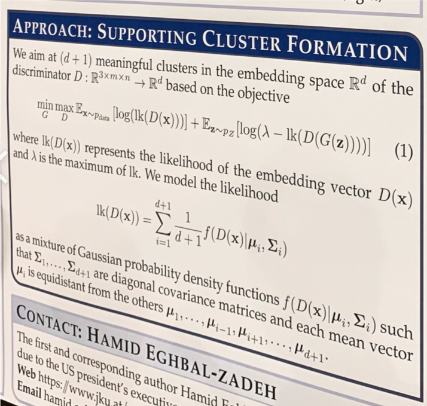

## MDGAN &mdash; Simple TensorFlow Implementation [[Paper]](https://arxiv.org/abs/1811.00152)
### : Mixture Density Generative Adversarial Networks

  

## Reference
* [MDGAN-Pytorch](https://github.com/haihabi/MD-GAN)

## Author
[Junho Kim](http://bit.ly/jhkim_ai)
